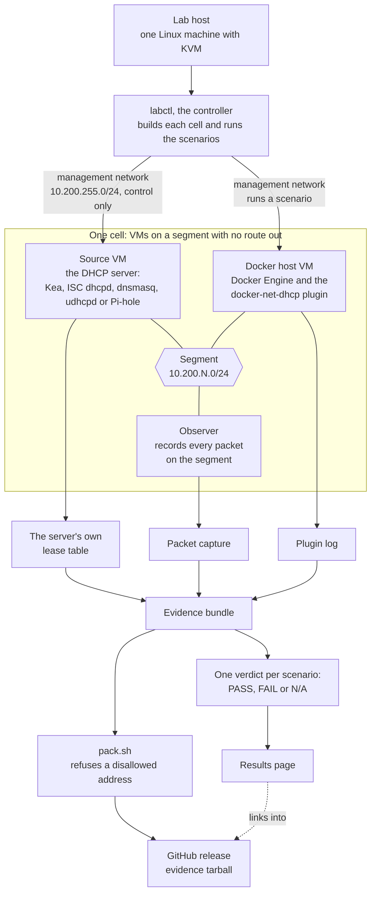

# docker-net-dhcp-lab

Tests [docker-net-dhcp](https://github.com/claymore666/docker-net-dhcp)
against real DHCP servers, each installed the way its users install it,
and publishes what passed. The plugin's own test suite uses one small
test server; this lab checks the plugin against the servers people run.

Results per release are in [`results/`](results/), one page per lab
release, with the full evidence attached to that release.

**[504 PASS, 6 N/A, 0 FAIL](results/v0.1.0.md)** in docker-net-dhcp-lab v0.1.0
over 3 DHCP servers, 2 Docker hosts, 5 network shapes, 17 scenarios per shape.

## How it works



Each scenario is judged by what the DHCP server's own lease table and the
observer's packet capture show, never by what the plugin says about itself.

What the lab runs on (a mark shown only to say the lab runs on that project):

<table>
<tr>
<th>Docker hosts</th><th></th><th>Plugin runs on</th><th colspan="4">DHCP servers</th>
</tr>
<tr>
<td align="center"></td>
<td align="center"></td>
<td align="center"></td>
<td align="center">Kea</td>
<td align="center">ISC dhcpd</td>
<td align="center">dnsmasq</td>
<td align="center">udhcpd</td>
<td align="center">Pi-hole</td>
</tr>
<tr>
<td align="center"><a href="https://www.debian.org/">Debian</a> 13</td>
<td align="center"><a href="https://ubuntu.com/">Ubuntu</a> 24.04 LTS</td>
<td align="center">Docker Engine 29.8.1 (<a href="https://github.com/moby/moby">moby/moby</a>)</td>
<td align="center"><a href="https://github.com/isc-projects/kea">isc-projects/kea</a></td>
<td align="center"><a href="https://github.com/isc-projects/dhcp">isc-projects/dhcp</a></td>
<td align="center"><a href="https://thekelleys.org.uk/dnsmasq/doc.html">dnsmasq</a></td>
<td align="center"><a href="https://busybox.net/">BusyBox</a> udhcpd</td>
<td align="center"><a href="https://github.com/pi-hole/pi-hole">pi-hole/pi-hole</a></td>
</tr>
</table>

At v0.1.0 the servers were the Debian 13 packages: Kea 2.6.3, ISC dhcpd
4.4.3-P1, dnsmasq 2.91. The udhcpd cell (issue #10) uses the Debian 13
package `udhcpd` 1:1.37.0-6, BusyBox 1.37; its host run is pending, host not
cleared. The Pi-hole cell installs Pi-hole 6 with its own installer (FTL 6.7.1
when first built), which is not pinned; its host run is pending, host not
cleared. The Debian, Ubuntu and Docker marks belong to their owners; their files and
licences are listed in [`docs/logos/`](docs/logos/README.md). No project
named here endorses this lab.

The terms in the picture:

- A **cell** is a small set of virtual machines on one isolated network:
  a Docker host with the plugin installed, and a DHCP server.
- A **source** is the DHCP server in a cell: Kea, ISC dhcpd, dnsmasq, udhcpd
  or Pi-hole, installed with its stock config plus an address pool (for
  Pi-hole the pool comes from the `pihole.toml` the lab writes).
- A **shape** is one way of creating the Docker network: `bridge`,
  `macvlan`, `ipvlan`, and the plugin as IPAM driver on a bridge
  (`bridge-ipam`) or on a macvlan network (`macvlan-ipam`).
- A **scenario** is one thing users do to a container, run on every
  shape against every source, then checked against the source's own
  lease table, never the plugin's report.

## Scenario groups

A scenario ID such as A14 names its group and its number, and evidence
files carry these IDs.

| Group | What it covers | Scenarios | When |
|---|---|---|---|
| A | everyday container journeys on every shape | A1 to A16, with the fixed-MAC reboot A5b | v0.1.0, #3 |
| B | router-side features: reservations, DNS registration, requested address, vendor class, option changes on renewal, lease release, ipvlan identity | B1 to B8 | v0.2.0, #23 |
| C | failure and hostile network: source down, restart without lease database, failover, squatter, rogue server, pool exhausted, renumbering, loss and latency, relay | C1 to C12b | v0.2.0, #23 (#11 relay cell, #12 failover cells) |
| D | IPv6: DHCPv6, SLAAC, managed flag, two prefixes | D1 to D4 | v0.2.0, #23 |
| E | operations and soak: audit ledger, metrics, host link names, VLAN parent, weeks-long soak | E1 to E5 | v0.3.0, #15 |
| F | server-side support for the plugin's v2.4.0 client features | one per feature, numbered in #20 | v0.2.0, #20 (#21 FORCERENEW sender) |

Group A runs today:

| ID | Scenario | What it does |
|---|---|---|
| A1 | first lease | start a container, it gets an address from the server |
| A2 | container restart | `docker restart`; the address stays |
| A3 | compose down/up | `docker compose down` then `up` |
| A4 | daemon restart | restart dockerd with containers running |
| A5 | host reboot | reboot the Docker host |
| A5b | host reboot, fixed MAC | the same, with a fixed `mac_address` |
| A6 | plugin upgrade | upgrade the plugin with containers running |
| A7 | plugin killed | kill the plugin process; it comes back, the lease holds |
| A8 | fleet burst | start many containers at once |
| A9 | stop, wait, start | stop, wait, start again |
| A10 | kill under a restart policy | the container crashes, Docker restarts it |
| A11 | pause/unpause | pause and unpause the container |
| A12 | network disconnect/reconnect | detach from the network and attach again |
| A13 | two networks, one container | a second, ordinary network beside the plugin one |
| A14 | short lease renewal | a short lease that must renew in time |
| A15 | compose scale | `docker compose up --scale` |
| A16 | forced remove | `docker rm -f` on a running container; the endpoint goes, the lease stays (the plugin default) |

Group B runs today (IPv4; a scenario whose source lacks the feature reports N/A, not a pass):

| ID | Scenario | What it does |
|---|---|---|
| B1 | reservation by MAC | the source reserves an address for a fixed MAC; the container must get it (not on ipvlan, which shares the parent's MAC) |
| B2 | reservation by client id | the source reserves an address for the `client_id` option; the container must get it |
| B3 | DNS registration | with `register_dns` the source answers a query for the container's hostname with the leased address (dnsmasq; Pi-hole expected, not yet confirmed on the host) |
| B4 | same MAC, same address | a container is removed and a new one with the same MAC must get the same address from the same single lease |
| B5 | vendor class pool | with `vendor_class` the source serves the address from the class pool |
| B6 | option change on renewal | the source changes its DNS option; after the lease renews, the container's `resolv.conf` carries the new server |
| B7 | lease release on remove | with `release_lease=on_remove` the source's table stops showing the lease after the container is removed |
| B8 | three at once | three live containers hold three distinct leases (ipvlan: one shared MAC, three client ids) |

B2, B3, B5, B6 and B7 run on their own network next to the cell's, removed afterwards. A source VM built before B5 needs a rebuild to get the class pool.

On `bridge-ipam` and `macvlan-ipam` B2, B5, B6 and B7 report N/A: the plugin's reference docs refuse a second network in that shape unless it names a different parent or its own subnet, so the lab cannot create the option-carrying network there. B8 runs on every shape.

Group C runs today (IPv4; the source is stopped, slowed, reset, narrowed or renumbered, or a squatter or a second server joins the segment, and everything is put back afterwards):

| ID | Scenario | What it does |
|---|---|---|
| C1 | source down at create | with the source stopped, `docker run` fails within `lease_timeout` (the default and `12s`), the DISCOVERs keep the plugin's 4 s and 8 s gaps, and no endpoint or lease is left |
| C2 | source down past T1 | the source stops after the bind and returns between T1 and T2; the client tried to renew while it was down and keeps its address |
| C3 | source down past expiry | the source stays down past the lease's expiry; within 120 s of its return the container carries an address the source's table shows for it |
| C4 | restart without lease file | the source restarts with an empty lease file; 135 s after the bind it holds exactly one lease for the container, on the address the container carries |
| C5 | failover, granting peer stopped | on the `kea-ha` and `isc-failover` cells: the peer that granted the lease stops 10 s after the bind; the client's renewals to it go unanswered, its rebind after T2 is answered by the other peer, and the container keeps its address throughout (T1 and T2 from the lease time the ACK itself carries) |
| C5b | failover, primary down at create | with the primary stopped and the partner taken over, a new container is leased by the partner within C1's bound, and the partner's table holds it |
| C5c | failover, primary returns | C5b's container is kept while the primary returns; the primary's table holds the outage lease, the container keeps its address through its next renewal, and a new container is leased |
| C5d | failover, no address given twice | 18 containers (10 with both peers up, 4 with the primary down, 4 after its return) carry 18 distinct addresses; no peer's table and no pair of ACKs gives one address to two clients at once |
| C6 | early squatter | with `conflict_check=wait`, a host that ignores ping already holds the address the source offers; the client declines it and the container never carries it |
| C6b | late squatter | with `conflict_check=async`, a host takes the container's address and announces it; within 30 s the client declines it and moves to an address the source leases to it |
| C7 | rogue server | a second DHCP server answers on the segment; a network with `dhcp_deny_servers` and one with `dhcp_servers` both lease from the real source, and the second server's lease file stays empty for them |
| C8 | pool exhausted | the pool is cut to two addresses, both held; a third container fails with no endpoint or link left, gets no lease once the pool is back, and a fourth container is leased |
| C9 | subnet renumbered | the source moves to a new subnet under a short lease; by 200 s after the bind the container carries the new lease, routes via the new source address and answers ping |
| C10 | reply delay and loss | a 2 s reply delay, then total loss until the client has sent two DISCOVERs; the container is leased both times |
| C11 | validate_dhcp at create | with `validate_dhcp=true` the create succeeds while the source is up and is refused within 12 s while it is down (macvlan and ipvlan; the plugin refuses the option on bridge) |
| C12 | relay | on the relay cell (`isc-dhcp-relay` between a client segment and the source's own segment), two containers bind through the relay, one on a network with `dhcp_servers` set to the source and `dhcp_deny_servers` set to the relay. The server-side capture shows the relay's DISCOVER and REQUEST with giaddr and option 82 and the source's reply echoing option 82 byte for byte; the client-side capture shows OFFER and ACK from the relay's MAC and address naming the source in option 54, no option 82, and no frame from the source itself; the lease matches the container's address and its default route is the relay. BLOCKED when the relay does not do that. N/A on every other cell (#11) |
| C12b | relay renewal | on the relay cell, a lease shortened to 120 s is held until 75 s after the bind; the first renewal REQUEST goes unicast to the source through the relay's client-side MAC with ciaddr set and giaddr 0, reaches the source with no option 82, and its ACK reaches the client; the address is unchanged, the expiry has moved and no broadcast REQUEST was sent. BLOCKED when the renewal never reaches the source's segment. N/A on every other cell (#11) |

C1, C6, C6b, C7, C8 (its third container), C9, C11 and C12 (its second container) run on their own networks, removed afterwards, and report N/A on `bridge-ipam` and `macvlan-ipam` for the same reason as group B; C12b creates no second network and runs on them. The wire rules read the observer's capture while the scenario runs; the segment bridge forwards every frame to every port (`ageing_time 0`), so the observer also sees unicast renewals.

Group D runs today (IPv6; each row creates its own network with the plugin's `ipv6_mode`, starts one container and reads its addresses inside the container, in docker inspect, in the source's DHCPv6 table and on the wire):

| ID | Scenario | What it does |
|---|---|---|
| D1 | DHCPv6 address | with `ipv6_mode=dhcp` the container leases an address over DHCPv6 (IA_NA); it sits on the link as a /128 with the server's lifetimes counting down, the source's table holds it for the container's DUID, docker inspect shows it, the default route goes via the advertising router, and it answers a ping from the source |
| D1b | DHCPv6 address, ipv6=true | the same checks with the older `ipv6=true` option instead of `ipv6_mode` |
| D1c | DHCPv6 mode without router advertisements | the source stops advertising; with `ipv6_mode=dhcp` the container still starts, and carries no IPv6 address unless the source's DHCPv6 server, which keeps running, answered it (recorded) |
| D2 | SLAAC address | with `ipv6_mode=slaac` the container forms its address from the advertised prefix and its own MAC (modified EUI-64), sends no DHCPv6 request and gets no lease; on ipvlan the network create must be refused |
| D2b | SLAAC mode without router advertisements | the source stops advertising; with `ipv6_mode=slaac` the container must fail to start (N/A on ipvlan, which refuses the mode) |
| D3a | auto mode, managed flag only | the source advertises the managed flag and no autonomous prefix; with `ipv6_mode=auto` the container must lease over DHCPv6 and pass the D1 checks. The flags are read from the captured advertisement, never from the source's config |
| D3b | auto mode, autonomous prefix only | the source advertises an autonomous prefix and no managed flag; with `ipv6_mode=auto` the container must form its address from the prefix as in D2 and send no DHCPv6 request |
| D3c | auto mode, DHCPv6 server silent | the source's DHCPv6 server is stopped while both flags stay advertised; with `ipv6_mode=auto` the container must fall back to the prefix (`/Plugin.Health` `dhcpv6_auto_fallbacks` corroborates), then with `ipv6_auto_strict=true` and with `ipv6_mode=dhcp` it must fail to start. N/A on dnsmasq, whose one daemon serves both |
| D3d | managed flag turned on at runtime | the container starts on an autonomous prefix, then the source turns the managed flag on; what the container does is recorded, not judged, because the plugin documents no behaviour for it |
| D4 | two advertised prefixes | the source advertises a second autonomous prefix; with `ipv6_mode=slaac` the container must form one address in each, and docker inspect must show the one in the first prefix of the advertisement as captured |
| D4m | two prefixes, ipv6_main_prefix | as D4 with `ipv6_main_prefix` naming the second prefix; docker inspect must show the address in that prefix |
| D4b | advertised prefix withdrawn | as D4, then the source stops advertising the second prefix: its address must go and, from plugin v2.2.3, its on-link route must stay; then the source advertises it with valid lifetime 0 and the route must go too. dnsmasq cannot send the second step, so there the first is judged alone |

Every source serves the same IPv6 baseline on the segment: router advertisements with the managed and autonomous flags set (radvd beside Kea and ISC, dnsmasq's own), and a DHCPv6 range in the lab's private prefix. A source VM built before group D must be rebuilt to carry it. The D3 and D4 rows change the source's advertisement for the row (managed and autonomous flags, a second prefix, a NAT64 prefix) and put it back afterwards, as group F does with the source's settings. On `bridge-ipam` and `macvlan-ipam`, which refuse a second network, D1, D1b and D2 recreate the cell's main network with the IPv6 option and rebuild it afterwards (BLOCKED if the rebuild fails); the other group D rows report N/A there, as they do on a plugin tag before v2.2.0, the release that added `ipv6_mode`. A row that still sees a router advertisement after the source stopped sending them is BLOCKED, not judged.

Group F runs today (the plugin's client options, judged by the bytes the container sends and by the source's own table; the source setting changes for the scenario and is put back afterwards):

| ID | Scenario | What it does |
|---|---|---|
| F1 | user class pool | with `user_class` the container sends a short label naming its kind of client (DHCP option 77); the source serves that label from its own address range, outside the main one |
| F2a | IPv6-only preferred, not asked for | the source has option 108 ("this network is IPv6 only, IPv4 is optional") set; the client never asks for it, so it never appears in its request list and the container keeps its IPv4 lease |
| F2b | IPv6-only preferred, sent unasked | the source sends option 108 to one client that did not ask; the client must ignore it and finish with an IPv4 lease, and a second client started meanwhile must not be sent it |
| F3 | rapid commit, IPv4 | with `rapid_commit` the client asks for a two-message lease (option 80); dnsmasq grants it, Pi-hole's embedded dnsmasq is expected to (the host run has not confirmed it yet), Kea and ISC answer as usual and the normal four messages follow |
| F4 | rapid commit, IPv6 | with `rapid_commit` and `ipv6_mode=dhcp` the client asks for a two-message DHCPv6 lease (option 14); every source that serves DHCPv6 grants it (not udhcpd or Pi-hole, whose cells are DHCPv4 only), so the exchange is a Solicit and a Reply, then the D1 checks. Before v2.4.0 the client must not ask and the four messages follow |
| F5 | temporary address | with `ipv6_temporary` the client also asks for a temporary address (IA_TA); ISC and dnsmasq grant one, which must be on the link beside the stable address, in the source's table and on `/Plugin.Health`, never in docker inspect. Kea grants none, so there the container must run as without the option |
| F6 | prefix delegation | with `ipv6_mode=dhcp` and `ipv6_pd=64` the client also asks for a delegated prefix (IA_PD); Kea and ISC delegate one, which must be in the Reply, in the source's table, as an `unreachable` route in the container and on `/Plugin.Health` `delegated_prefixes`. dnsmasq delegates none, so there the container must run with no delegated prefix. On ipvlan the network create must be refused. From plugin v2.5.0 |
| F7 | NAT64 prefix | with `ipv6_mode=slaac` the source's advertisement carries a NAT64 prefix (RFC 8781); after the lease `/Plugin.Health` `nat64_prefixes` must equal it and nothing is installed in the container. dnsmasq's advertisement cannot carry one, so there the field must stay absent. N/A on ipvlan. From plugin v2.4.0 |
| F8 | FORCERENEW, signed and unsigned | FORCERENEW is a server telling a client "renew your lease now", trusted only when signed with a secret the server put in the lease (RFC 6704); the lab sends the container one unsigned, one wrongly signed and one correctly signed: it must ignore the first two and renew on the third, keeping its address. Before v2.4.0 the client must ignore the unsigned one |

The user class, forced 108, rapid commit and temporary address rows run on their own network, removed afterwards, and report N/A on `bridge-ipam` and `macvlan-ipam` for the same reason as group B. The user class, rapid commit and temporary address rows read the plugin tag in `lab.yaml`: a release before v2.4.0 must send none of these options, and a tag that is not a release leaves them BLOCKED. The two IPv6 rows also need v2.2.0 and are N/A before it. A source VM needs no rebuild for group F; the settings are written at run time.

## Reading a result

Each scenario on each shape and source gets one verdict:

- **PASS**: the check held; the verdict links the evidence (lease table
  before and after, packet capture, plugin log).
- **FAIL**: a finding about the plugin. The lab never retries or tunes a
  scenario to make it pass.
- **BLOCKED**: the lab could not reach a known starting state, with the
  reason. Before every shape it waits, at most 30 s, for the
  segment NIC to lose the previous shape's child link and records the wait
  in the evidence bundle (`<cell>-<shape>-parent-ready.txt`); a child that
  is still there blocks the shape and is named. A reboot scenario whose
  docker host never answers ssh again within its 3 min bound is BLOCKED
  too; a host that answers but stays on the old boot is a FAIL.
- **N/A**: the scenario does not apply, with the reason. Example: an
  `ipvlan` container shares its parent's MAC, so the fixed-MAC reboot
  cannot run there.

On `ipvlan`, container restart and host reboot pass with a note when the
address changes: the plugin keeps no record of the old address on
`ipvlan`, so a new address there is documented behaviour (plugin repo,
`docs/reference.md`, "Restart stability (MAC and IP)", claymore666/docker-net-dhcp#219). The
verdict still requires a lease for the new address and that the server
can reach the container.

## Bring up the reference cell

```
scripts/bootstrap-host.sh          # once per lab host
scripts/demo-ref-cell.sh ref-only  # one command, issue #1
scripts/down-cell.sh ref-only <work-dir>  # tear it back down
```

`lab.yaml` declares the cells; `verify.sh` is the arbiter (CI runs it on
every push and PR).

## Bring up a source cell

Kea, ISC dhcpd, dnsmasq and udhcpd each get their own cell, apt-installed with a
stock config plus a pool (issue #2). The Pi-hole cell runs Pi-hole's own
installer on Debian 13 with a `pihole.toml` that turns DHCP on (issue
#10). A Go adapter reads each source's own lease table (control API,
`dhcpd.leases`, the dnsmasq lease file, `dumpleases` for udhcpd, or Pi-hole's
`dhcp.leases`), never the plugin's own report.

```
scripts/demo-source-cell.sh kea        # or isc-dhcp, dnsmasq, udhcpd, or pihole
scripts/down-cell.sh kea <work-dir>
```

| Source | Cell | Host run |
|---|---|---|
| Kea, ISC dhcpd, dnsmasq | `kea`, `isc-dhcp`, `dnsmasq` | v0.1.0 results page |
| udhcpd | `udhcpd` | pending, host not cleared |
| Pi-hole | `pihole` | pending, host not cleared |
| MikroTik CHR | `chr` | pending, host not cleared |
| OpenWrt 25.12 | `openwrt` | pending, host not cleared |

Pi-hole's FTL is an embedded dnsmasq that rebuilds its dnsmasq config from
`pihole.toml` on every start, so the lab never edits the toml: scenario
changes go in `/etc/dnsmasq.d/90-lab.conf`, and reservations in
`/etc/dnsmasq.d/lab-reservations.conf`. FTL owns the address range and the
lease time there, so A14, B5, B6, C2, C3, C4, C5, C5c, C8, C9 and the
user-class pool row report N/A on the Pi-hole cell, as do all DHCPv6 rows
(D1 to D4b, DHCPv6 rapid commit, temporary address, prefix delegation and
PREF64), because the cell is DHCPv4 only; the dnsmasq cell covers the first
group.

The `chr` cell runs MikroTik's Cloud Hosted Router 7.24.5 (RouterOS, free
licence, issue #9), seeded through its QEMU guest agent and driven with the
RouterOS command line over ssh; it has no Linux shell. The rows that need a
helper program on the source VM report N/A there: C6 and C6b (squatter), C7
(rogue server), C10 (loss and latency) and F8-forcerenew. B3 is N/A because
the router's resolver does not answer the segment in its stock config, and
all DHCPv6 rows are N/A because the cell is DHCPv4 only (the seed turns
IPv6 off).

The OpenWrt cell (issue #9) boots an image that
`scripts/build-openwrt-image.sh openwrt` builds once with the OpenWrt
ImageBuilder: the cell's addresses, pool and key are baked in, there is no
`br-lan`, and odhcpd's RA and DHCPv6 are off, so the cell is DHCPv4 only.
Scenario changes go through `uci` where OpenWrt has an option, else into
`/etc/dnsmasq.conf`. C6, C6b, C7, C10 and F8-forcerenew report N/A there: they
run against dnsmasq on the dnsmasq cell, and here would need `tc`, netem,
macvlan and python3 in the image. The DHCPv6 rows are N/A as on Pi-hole.

`labctl leases <source-type> <mgmt-ip> <known-hosts>` prints one
source's table on its own, through the same adapter.

The `kea-ha` cell is a failover pair: two Kea VMs on one segment in
hot-standby, with `max-unacked-clients 0`, so the partner takes over at
once when the primary stops (issue #12). `up-cell.sh` builds both
peers and `down-cell.sh` removes both. C5 to C5d run only on pair cells. On
that cell C1 to C4 stop or reset both peers together, C8 narrows both
pools, and C6 and C7 act from the primary's VM. Only the primary
serves DHCPv6 and router advertisements: the partner stops both, since
two unpaired DHCPv6 servers would hand out one pool twice. Group D and
the IPv6 rows of group F act on the primary alone, and IPv6 failover is
outside issue #12. C9, C10, C12 and C12b report
N/A with the reason: a renumbered peer drops the failover setup, a
delay on one peer is split brain, and the pair is not a relay. Each
PASS or FAIL lists both peers' failover state before and after the
scenario, recorded but not judged. A BLOCKED verdict lists no evidence,
so its two state files sit in the cell's evidence directory unlisted.

The `isc-failover` cell is the same shape with ISC dhcpd 4.4 failover
(issue #12): primary and secondary, load balanced with `split 128`,
`mclt 60` on the primary and `load balance max seconds 3`, so both peers
answer while the pair is normal and C5d needs both server identifiers.
A stopped peer leaves the other in `communications-interrupted`, which
serves new clients from its own half of the pool. The lease time a
client is granted differs from the cell's 120 s: in a local run the
first grant carried 60 s and a renewal answered by the surviving peer
after the primary stopped carried 600 s. C5 therefore takes T1, T2 and
the expiry from the ACK's option 51. C5b requires
the new container's address to come from the half the primary holds as
`backup` and is BLOCKED otherwise. C5c accepts the renewal of the kept
address from either peer, because the client renews with the server that
granted the lease and a load-balanced peer answers it. The state of each
peer is the last block of its `dhcpd.leases`; a file with no state block
asks `omshell`, and so does every wait for `normal` after a start, because
a restarted peer's file keeps its old `normal` block (the template opens
`omapi-port 7911` on both VMs, with no key, on the lab's isolated
networks). The partner serves no DHCPv6 and no
router advertisements, as on `kea-ha`. The resource-bound line below
applies to it as well.

## Run every scenario on a cell

`scripts/run-cell.sh <cell-name> [work-dir] [evidence-dir]` brings a
cell up, runs every scenario on all five shapes, and tears the cell back
down. It leaves one evidence bundle: the resolved `lab.yaml`,
plugin/engine/kernel versions, a config diff from the source's stock
install, one packet capture for the whole run, lease-table snapshots,
the plugin's own log, and one verdict file per scenario and shape.

`scripts/run-cells.sh [-j N] [--stagger SECONDS] [--root DIR] [--check] <cell-name>...` runs
several cells at once on one host and leaves one evidence bundle per cell
under `<root>/evidence/<cell>`, with its output in `<root>/logs/<cell>.log`
and its exit code in `<root>/logs/<cell>.rc` (`--root` defaults to
`/srv/lab/work/<user>`). N defaults to the smaller of the cell count,
`(vCPUs - 2) / 3` and `(free memory in GiB - 4) / 3`, never below 1. That
bound assumes 3 vCPUs and 3 GiB per cell; a `kea-ha` or `isc-failover`
cell has a third VM and takes 4 and 4 GiB, so the default can overcommit by
one vCPU and 1 GiB per pair cell in the run. A
larger `-j` is accepted and reported as an overcommit: six cells are 18
guest vCPUs, and on a 16-vCPU host with three of them rebooting at once
their guests stopped accepting new ssh connections for about four minutes
(#38). `labctl run` therefore retries an ssh call whose connection failed
before the remote command ran, for up to 5 min; once that bound is used up,
later calls to the same guest try once each until one succeeds. Starts are spaced
`--stagger` seconds apart (default 60, `0` disables) so that the guests do
not all boot, install the plugin and open ssh at the same moment. A cell
that fails does not stop the others, is torn down with `down-cell.sh` as
soon as it exits, and the exit code is 1 if any cell's was not 0.
Before the first start it resolves every cell and refuses if two share a
name, VM name, bridge, management address, observer container, observer
veth or directory, or if any of those VMs or containers already exists on
the host; `--check` prints that table and stops there. Before each start it
wants 15 GiB free under the root (`LAB_MIN_FREE_GIB`), waits up to ten
minutes for it, and otherwise marks the cell `skipped-disk`; it also looks
again for that cell's VMs and observer and marks the cell `skipped-exists`
if they have appeared meanwhile. INT or TERM
stops every running cell and tears it down with `down-cell.sh`. Two
`run-cells.sh` started within the same minutes on overlapping cells are only
caught once the first has defined its VMs, so do not do that. Render the
results the same way as for one cell:
`labctl matrix --root <root>/evidence <root>/evidence/<cell>...`.

`labctl run <lab.yaml> <repo-root> <cell-name> <shape> <work-dir>
<evidence-dir> <pcap-path|->` runs one shape's scenarios directly, for a
single-shape re-run.

### Verdict file format

One file per scenario x cell x shape, named
`<cell>-<shape>-<scenario>.verdict`; a re-run overwrites its own prior
file. Plain `key: value` lines:

```
scenario: <scenario id>
cell: kea
shape: bridge
result: PASS
reason: lease confirmed in the source's own table
git_sha: <commit the run used>
timestamp: 2026-01-01T00:00:00Z
evidence.lease_after: <path>
```

`result` is `PASS`, `FAIL` or `N/A`. A `PASS` always carries at least
one `evidence.<label>: <path>` line pointing at a real, non-empty file
in the bundle; an `N/A` carries none, only a `reason`. The results page
shows each scenario by its plain name.

## Results page

`labctl matrix --root <bundle-root> [--out results/<tag>.md] [--asset
<name>] <bundle-dir> [<bundle-dir> ...]` reads one or more evidence
bundles and writes the results page: one row per scenario, in plain
words (never a scenario id), one column per cell x shape, each cell a
`PASS`/`FAIL`/`N/A`/`BLOCKED` link straight to its verdict file, written
relative to `--root` so the same page still resolves once `--root` is a
packed bundle's own extracted directory, and refused outright if
`--root` is not an ancestor of a bundle, so no link leaves it. A verdict `labctl matrix` cannot find for a
scenario x column prints `(missing)`; it is never left out of the
table. `--asset` names the release asset the page's relative links live
in, printed once in the header; it is optional, and the header is
unchanged without it. The plain-word names live in one place,
`internal/matrix/names.go`.

The relay cell's `versions.txt` carries a `relay isc-dhcp-relay:` line with the
package version. C12 and C12b results hold for that relay version only; read it there
before comparing two runs of the relay cell.

## Coverage check

The plugin documents its options in three tables in `docs/reference.md`
(driver options, per-endpoint options, plugin settings). The check
reads those tables and holds the lab to them.

`labctl coverage (--tag vX.Y.Z | --file path/to/reference.md)` parses the
tables and fails when a row is missing from `internal/coverage/data/inventory.yaml`,
when a backticked value in a row is not classed there, when a row changed
since a person last reviewed it, or when an option has neither a scenario
nor a recorded reason in `internal/coverage/mapping.go`. It exits 0 on the
pinned v2.5.0 reference. `--tag` fetches the file and compares it with the
pinned copy (a tag with no pinned copy prints a notice; a pinned copy that
cannot be read is a problem); `--file` needs no network. Exit codes: 0
clean, 1 problems found, 2 usage, 3 the docs could not be fetched or read,
so a network outage is not mistaken for a finding.

`labctl coverage --pinned vX.Y.Z [--regen]` goes further. From the pinned
`docs/reference.md` and the inventory it generates the option matrix
(`internal/coverage/data/matrix.tsv`: every value, alias spelling, refused
value, option pair and IPv6 environment profile the docs imply, including
the option combinations and the value-in-mode combinations the docs say
the plugin refuses at network create, such as `ipv6_mode=slaac` in
`mode=ipvlan`, which are placed as create-time checks) and checks
that each variant has exactly one placement in
`internal/coverage/data/placements.yaml`: a plugin test, a lab scenario, a
gap with an issue, or an N/A with a reason. It exits 1 and names every
unplaced variant. The placements file is empty for now, so `--pinned
v2.5.0` fails until it is filled. `--regen` rewrites `matrix.tsv` instead
of comparing with it.

`labctl coverage pin --plugin-tree DIR --tag vX.Y.Z` copies `docs/reference.md`
and the list of plugin test names from a clean checkout of that tag into
`internal/coverage/data/pinned/vX.Y.Z/`. It refuses a tree whose HEAD is
not the tag.

`TestPinnedMatrixIsCurrent` regenerates the matrix from the pinned
reference and requires it to equal the checked-in `matrix.tsv`. It needs
no network, so it runs in `verify.sh` as part of `go test ./...`. The
network-facing parts (`--tag`) stay out of `verify.sh`, which is
network-free by design.

## Packing a bundle for release

`scripts/pack.sh <bundle-dir> <out.tar.gz> <denylist-file>` turns one
evidence bundle into a compressed tarball for a GitHub release asset
(attaching it to a release is a separate, later step, not this
script's). The denylist is required, as a third argument or via
`LAB_PACK_DENYLIST`: it is a local list of names that must not appear,
kept outside this repo, and packing refuses outright, with no tarball
written, if it is missing or its path names no real file; the check is
never skipped. Packing also refuses, and writes nothing,
when the bundle carries a disallowed address (the same patterns
`scripts/hygiene-check.sh` uses, shared via
`scripts/hygiene-patterns.sh`, one copy only -- Docker's own
default bridge range and Kea's stock example config range are both
allowed, since neither is LAN detail), a hostname in a captured
`journalctl` line that is not this lab's own generated shape (`lab-*`),
or a `evidence.<label>` line in a verdict file naming a path outside the
bundle (an older run's own machine layout, never real evidence). A
packet capture (`.pcap`) is never text-scanned by this check; nothing in
this repo reads one automatically today, so each is checked by hand
before a bundle is packed.

## Lab host safety

Every VM boots UEFI (OVMF); its per-VM NVRAM copy lives under the cell's
work directory and `down-cell.sh` removes it. `up-cell.sh` refuses to
attach a VM to `net-mgmt` unless the host's `ci_dmz` firewall chain is
present at priority -10 with a rule that drops by destination
(`scripts/containment-preflight.sh`, run via `sudo -n` since reading
nftables state needs root). That check only reads the ruleset text; it
cannot prove traffic is actually blocked end to end. The proof of that
is `dmz-probe.sh ""` run inside the Docker host VM at a live run, not
this preflight.
