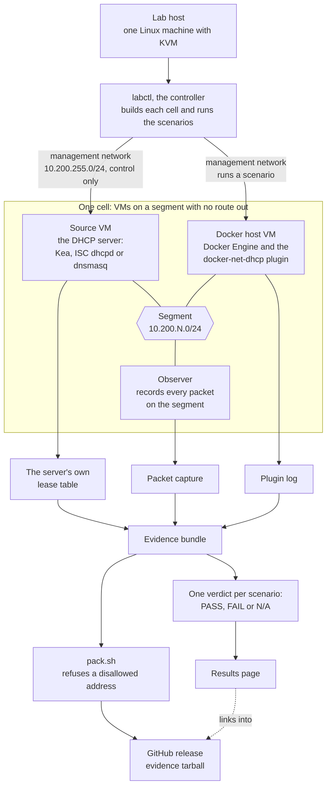

# docker-net-dhcp-lab

Tests [docker-net-dhcp](https://github.com/claymore666/docker-net-dhcp)
against real DHCP servers, each installed the way its users install it,
and publishes what passed. The plugin's own test suite uses one small
test server; this lab checks the plugin against the servers people run.

Results per release are in [`results/`](results/), one page per lab
release, with the full evidence attached to that release.

**[504 PASS, 6 N/A, 0 FAIL](results/v0.1.0.md)** in docker-net-dhcp-lab v0.1.0
over 3 DHCP servers, 2 Docker hosts, 5 network shapes, 17 scenarios per shape.

## How it works



Each scenario is judged by what the DHCP server's own lease table and the
observer's packet capture show, never by what the plugin says about itself.

What the lab runs on (a mark shown only to say the lab runs on that project):

<table>
<tr>
<th>Docker hosts</th><th></th><th>Plugin runs on</th><th colspan="3">DHCP servers</th>
</tr>
<tr>
<td align="center"></td>
<td align="center"></td>
<td align="center"></td>
<td align="center">Kea</td>
<td align="center">ISC dhcpd</td>
<td align="center">dnsmasq</td>
</tr>
<tr>
<td align="center"><a href="https://www.debian.org/">Debian</a> 13</td>
<td align="center"><a href="https://ubuntu.com/">Ubuntu</a> 24.04 LTS</td>
<td align="center">Docker Engine 29.8.1 (<a href="https://github.com/moby/moby">moby/moby</a>)</td>
<td align="center"><a href="https://github.com/isc-projects/kea">isc-projects/kea</a></td>
<td align="center"><a href="https://github.com/isc-projects/dhcp">isc-projects/dhcp</a></td>
<td align="center"><a href="https://thekelleys.org.uk/dnsmasq/doc.html">dnsmasq</a></td>
</tr>
</table>

At v0.1.0 the servers were the Debian 13 packages: Kea 2.6.3, ISC dhcpd
4.4.3-P1, dnsmasq 2.91. The Debian, Ubuntu and Docker marks belong to their owners; their files and
licences are listed in [`docs/logos/`](docs/logos/README.md). No project
named here endorses this lab.

The terms in the picture:

- A **cell** is a small set of virtual machines on one isolated network:
  a Docker host with the plugin installed, and a DHCP server.
- A **source** is the DHCP server in a cell: Kea, ISC dhcpd or dnsmasq,
  apt-installed with its stock config plus an address pool.
- A **shape** is one way of creating the Docker network: `bridge`,
  `macvlan`, `ipvlan`, and the plugin as IPAM driver on a bridge
  (`bridge-ipam`) or on a macvlan network (`macvlan-ipam`).
- A **scenario** is one thing users do to a container, run on every
  shape against every source, then checked against the source's own
  lease table, never the plugin's report.

## Scenario groups

A scenario ID such as A14 names its group and its number, and evidence
files carry these IDs.

| Group | What it covers | Scenarios | When |
|---|---|---|---|
| A | everyday container journeys on every shape | A1 to A16, with the fixed-MAC reboot A5b | v0.1.0, #3 |
| B | router-side features: reservations, DNS registration, requested address, vendor class, option changes on renewal, lease release, ipvlan identity | B1 to B8 | v0.2.0, #23 |
| C | failure and hostile network: source down, restart without lease database, failover, squatter, rogue server, pool exhausted, renumbering, loss and latency, relay | C1 to C12 | v0.2.0, #23 (#11 relay cell, #12 failover cells) |
| D | IPv6: DHCPv6, SLAAC, managed flag, two prefixes | D1 to D4 | v0.2.0, #23 |
| E | operations and soak: audit ledger, metrics, host link names, VLAN parent, weeks-long soak | E1 to E5 | v0.3.0, #15 |
| F | server-side support for the plugin's v2.4.0 client features | one per feature, numbered in #20 | v0.2.0, #20 (#21 FORCERENEW sender) |

Group A runs today:

| ID | Scenario | What it does |
|---|---|---|
| A1 | first lease | start a container, it gets an address from the server |
| A2 | container restart | `docker restart`; the address stays |
| A3 | compose down/up | `docker compose down` then `up` |
| A4 | daemon restart | restart dockerd with containers running |
| A5 | host reboot | reboot the Docker host |
| A5b | host reboot, fixed MAC | the same, with a fixed `mac_address` |
| A6 | plugin upgrade | upgrade the plugin with containers running |
| A7 | plugin killed | kill the plugin process; it comes back, the lease holds |
| A8 | fleet burst | start many containers at once |
| A9 | stop, wait, start | stop, wait, start again |
| A10 | kill under a restart policy | the container crashes, Docker restarts it |
| A11 | pause/unpause | pause and unpause the container |
| A12 | network disconnect/reconnect | detach from the network and attach again |
| A13 | two networks, one container | a second, ordinary network beside the plugin one |
| A14 | short lease renewal | a short lease that must renew in time |
| A15 | compose scale | `docker compose up --scale` |
| A16 | forced remove | `docker rm -f` on a running container; the endpoint goes, the lease stays (the plugin default) |

Group B runs today (IPv4; a scenario whose source lacks the feature reports N/A, not a pass):

| ID | Scenario | What it does |
|---|---|---|
| B1 | reservation by MAC | the source reserves an address for a fixed MAC; the container must get it (not on ipvlan, which shares the parent's MAC) |
| B2 | reservation by client id | the source reserves an address for the `client_id` option; the container must get it |
| B3 | DNS registration | with `register_dns` the source answers a query for the container's hostname with the leased address (dnsmasq only) |
| B4 | same MAC, same address | a container is removed and a new one with the same MAC must get the same address from the same single lease |
| B5 | vendor class pool | with `vendor_class` the source serves the address from the class pool |
| B6 | option change on renewal | the source changes its DNS option; after the lease renews, the container's `resolv.conf` carries the new server |
| B7 | lease release on remove | with `release_lease=on_remove` the source's table stops showing the lease after the container is removed |
| B8 | three at once | three live containers hold three distinct leases (ipvlan: one shared MAC, three client ids) |

B2, B3, B5, B6 and B7 run on their own network next to the cell's, removed afterwards. A source VM built before B5 needs a rebuild to get the class pool.

On `bridge-ipam` and `macvlan-ipam` B2, B5, B6 and B7 report N/A: the plugin's reference docs refuse a second network in that shape unless it names a different parent or its own subnet, so the lab cannot create the option-carrying network there. B8 runs on every shape.

Group C runs today (IPv4; the source is stopped, slowed or reset, and put back afterwards):

| ID | Scenario | What it does |
|---|---|---|
| C1 | source down at create | with the source stopped, `docker run` fails within `lease_timeout` (the default and `12s`), the DISCOVERs keep the plugin's 4 s and 8 s gaps, and no endpoint or lease is left |
| C2 | source down past T1 | the source stops after the bind and returns between T1 and T2; the client tried to renew while it was down and keeps its address |
| C3 | source down past expiry | the source stays down past the lease's expiry; within 120 s of its return the container carries an address the source's table shows for it |
| C4 | restart without lease file | the source restarts with an empty lease file; 135 s after the bind it holds exactly one lease for the container, on the address the container carries |
| C5 | failover, primary killed | N/A on every source until the failover cells exist (#12) |
| C10 | reply delay and loss | a 2 s reply delay, then total loss until the client has sent two DISCOVERs; the container is leased both times |
| C11 | validate_dhcp at create | with `validate_dhcp=true` the create succeeds while the source is up and is refused within 12 s while it is down (macvlan and ipvlan; the plugin refuses the option on bridge) |
| C12 | relay | N/A on every source until the relay cell exists (#11) |

C1 and C11 run on their own networks, removed afterwards, and report N/A on `bridge-ipam` and `macvlan-ipam` for the same reason as group B. The wire rules read the observer's capture while the scenario runs; the segment bridge forwards every frame to every port (`ageing_time 0`), so the observer also sees unicast renewals.

Group F runs today (IPv4; the plugin's client options, judged by the bytes the container sends and by the source's own table; the source setting changes for the scenario and is put back afterwards):

| ID | Scenario | What it does |
|---|---|---|
| F1 | user class pool | with `user_class` the container sends a short label naming its kind of client (DHCP option 77); the source serves that label from its own address range, outside the main one |
| F2a | IPv6-only preferred, not asked for | the source has option 108 ("this network is IPv6 only, IPv4 is optional") set; the client never asks for it, so it never appears in its request list and the container keeps its IPv4 lease |
| F2b | IPv6-only preferred, sent unasked | the source sends option 108 to one client that did not ask; the client must ignore it and finish with an IPv4 lease, and a second client started meanwhile must not be sent it |
| F3 | rapid commit, IPv4 | with `rapid_commit` the client asks for a two-message lease (option 80); dnsmasq grants it, Kea and ISC answer as usual and the normal four messages follow |
| F4 | rapid commit, IPv6 | N/A on every source until the IPv6 segment exists (#23 group D) |
| F5 | temporary address | N/A on every source until the IPv6 segment exists (#23 group D) |
| F6 | prefix delegation | N/A on every source until the IPv6 segment exists (#23 group D) |
| F7 | NAT64 prefix | N/A on every source until the IPv6 segment exists (#23 group D) |
| F8 | FORCERENEW, signed and unsigned | FORCERENEW is a server telling a client "renew your lease now", trusted only when signed with a secret the server put in the lease (RFC 6704); the lab sends the container one unsigned, one wrongly signed and one correctly signed: it must ignore the first two and renew on the third, keeping its address. Before v2.4.0 the client must ignore the unsigned one |

The user class, forced 108 and rapid commit rows run on their own network, removed afterwards, and report N/A on `bridge-ipam` and `macvlan-ipam` for the same reason as group B. The user class and rapid commit rows read the plugin tag in `lab.yaml`: a release before v2.4.0 must send neither option, and a tag that is not a release leaves them BLOCKED. A source VM needs no rebuild for group F; the settings are written at run time.

## Reading a result

Each scenario on each shape and source gets one verdict:

- **PASS**: the check held; the verdict links the evidence (lease table
  before and after, packet capture, plugin log).
- **FAIL**: a finding about the plugin. The lab never retries or tunes a
  scenario to make it pass.
- **N/A**: the scenario does not apply, with the reason. Example: an
  `ipvlan` container shares its parent's MAC, so the fixed-MAC reboot
  cannot run there.

On `ipvlan`, container restart and host reboot pass with a note when the
address changes: the plugin keeps no record of the old address on
`ipvlan`, so a new address there is documented behaviour (plugin repo,
`docs/reference.md`, "Restart stability (MAC and IP)", claymore666/docker-net-dhcp#219). The
verdict still requires a lease for the new address and that the server
can reach the container.

## Bring up the reference cell

```
scripts/bootstrap-host.sh          # once per lab host
scripts/demo-ref-cell.sh ref-only  # one command, issue #1
scripts/down-cell.sh ref-only <work-dir>  # tear it back down
```

`lab.yaml` declares the cells; `verify.sh` is the arbiter (CI runs it on
every push and PR).

## Bring up a source cell

Kea, ISC dhcpd and dnsmasq each get their own cell, apt-installed with a
stock config plus a pool (issue #2). A Go adapter reads each source's
own lease table (control API, `dhcpd.leases`, or the dnsmasq lease
file), never the plugin's own report.

```
scripts/demo-source-cell.sh kea        # or isc-dhcp, or dnsmasq
scripts/down-cell.sh kea <work-dir>
```

`labctl leases <source-type> <mgmt-ip> <known-hosts>` prints one
source's table on its own, through the same adapter.

## Run every scenario on a cell

`scripts/run-cell.sh <cell-name> [work-dir] [evidence-dir]` brings a
cell up, runs every scenario on all five shapes, and tears the cell back
down. It leaves one evidence bundle: the resolved `lab.yaml`,
plugin/engine/kernel versions, a config diff from the source's stock
install, one packet capture for the whole run, lease-table snapshots,
the plugin's own log, and one verdict file per scenario and shape.

`labctl run <lab.yaml> <repo-root> <cell-name> <shape> <work-dir>
<evidence-dir> <pcap-path|->` runs one shape's scenarios directly, for a
single-shape re-run.

### Verdict file format

One file per scenario x cell x shape, named
`<cell>-<shape>-<scenario>.verdict`; a re-run overwrites its own prior
file. Plain `key: value` lines:

```
scenario: <scenario id>
cell: kea
shape: bridge
result: PASS
reason: lease confirmed in the source's own table
git_sha: <commit the run used>
timestamp: 2026-01-01T00:00:00Z
evidence.lease_after: <path>
```

`result` is `PASS`, `FAIL` or `N/A`. A `PASS` always carries at least
one `evidence.<label>: <path>` line pointing at a real, non-empty file
in the bundle; an `N/A` carries none, only a `reason`. The results page
shows each scenario by its plain name.

## Results page

`labctl matrix --root <bundle-root> [--out results/<tag>.md] [--asset
<name>] <bundle-dir> [<bundle-dir> ...]` reads one or more evidence
bundles and writes the results page: one row per scenario, in plain
words (never a scenario id), one column per cell x shape, each cell a
`PASS`/`FAIL`/`N/A`/`BLOCKED` link straight to its verdict file, written
relative to `--root` so the same page still resolves once `--root` is a
packed bundle's own extracted directory, and refused outright if
`--root` is not an ancestor of a bundle, so no link leaves it. A verdict `labctl matrix` cannot find for a
scenario x column prints `(missing)`; it is never left out of the
table. `--asset` names the release asset the page's relative links live
in, printed once in the header; it is optional, and the header is
unchanged without it. The plain-word names live in one place,
`internal/matrix/names.go`.

## Coverage check

`labctl coverage (--tag vX.Y.Z | --file path/to/reference.md)` reads the
plugin repo's `docs/reference.md` at a tag (or a local file, for tests or
a pinned copy) and checks its three option tables (driver options,
per-endpoint options, plugin settings) against `internal/coverage/mapping.go`,
this lab's own reviewed record of which option a scenario actually
exercises. An option with neither a scenario nor a recorded reason
("not covered yet, planned", for example) fails the check and is named
in its output. It is a `labctl` subcommand, not a `verify.sh` step:
`verify.sh` is deliberately network-free (its own header comment), and
there is no pinned local copy of `docs/reference.md` in this repo to run
it against instead.

## Packing a bundle for release

`scripts/pack.sh <bundle-dir> <out.tar.gz> <denylist-file>` turns one
evidence bundle into a compressed tarball for a GitHub release asset
(attaching it to a release is a separate, later step, not this
script's). The denylist is required, as a third argument or via
`LAB_PACK_DENYLIST`: it is a local list of names that must not appear,
kept outside this repo, and packing refuses outright, with no tarball
written, if it is missing or its path names no real file; the check is
never skipped. Packing also refuses, and writes nothing,
when the bundle carries a disallowed address (the same patterns
`scripts/hygiene-check.sh` uses, shared via
`scripts/hygiene-patterns.sh`, one copy only -- Docker's own
default bridge range and Kea's stock example config range are both
allowed, since neither is LAN detail), a hostname in a captured
`journalctl` line that is not this lab's own generated shape (`lab-*`),
or a `evidence.<label>` line in a verdict file naming a path outside the
bundle (an older run's own machine layout, never real evidence). A
packet capture (`.pcap`) is never text-scanned by this check; nothing in
this repo reads one automatically today, so each is checked by hand
before a bundle is packed.

## Lab host safety

Every VM boots UEFI (OVMF); its per-VM NVRAM copy lives under the cell's
work directory and `down-cell.sh` removes it. `up-cell.sh` refuses to
attach a VM to `net-mgmt` unless the host's `ci_dmz` firewall chain is
present at priority -10 with a rule that drops by destination
(`scripts/containment-preflight.sh`, run via `sudo -n` since reading
nftables state needs root). That check only reads the ruleset text; it
cannot prove traffic is actually blocked end to end. The proof of that
is `dmz-probe.sh ""` run inside the Docker host VM at a live run, not
this preflight.
